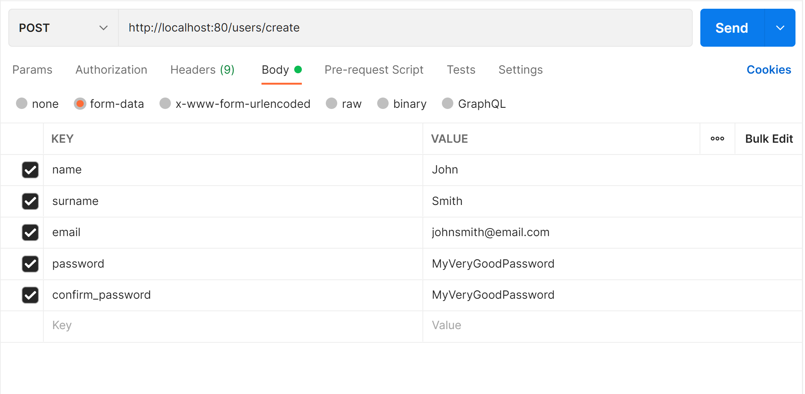

(English [here](#english))


# Application Mission
Ceci est une application pour affecter des tâches à des utilisateurs et les modifier après les avoir faits. C'est application était fait pour une mission d'un job, *et est sous le license AGPL.*

Cette application n'est pas prête pour production, et est actuellement seulement approprié pour localhost.

Vous pouvez trouver des captures d'écran dans `screenshots/`.

## Commencer
Pour commencer, il faut installer Android Studio, et Python.

### Backend
Pour la partie backend, il faudra installer les requirements et puis lancer le backend.

- Installer les requirements
  ```bash
  cd backend
  python -m pip install -r requirements.txt
  ```
- Lancer le backend
  ```bash
  cd .. # rentre au root du projet
  python -m backend
  ```

  Il va se lancer avec toutes les informations nécessaires (voir [environment variables](#variables))

### Frontend
Le frontend est une application fait en Kotlin pour Android 11 (API 30) Java 1.8. Pour le lancer, il faut ouvrir le dossier `frontend` avec Android Studio, puis lancer l'application sur votre appareil préféré.

A l'instant, il se connecte à `10.0.2.2`, qui est l'adressse IP du hôte (quand on utilise un émulateur). Vous pouvez changer cette adresse dans `MainActivity.kt:39`.

### Variables
Les variables de l'environment sont:
- `JWT_SECRET`: Le secret utilisé pour configurer les jetons JWT. (Si pas fourni, il sera généré à chaque lancement. Tout jeton précedent sera invalidé.)
- `SQLALCHEMY_DATABASE_URI`: L'adresse de la base de données (si aucune adresse est fournie, il va utiliser une base de données SQLite en memoire)
- `SECRET_KEY`: Le secret utilisé par Flask pour configuer les jetons session (non utilisé par l'application, mais quand même nécessaire). Si pas fourni, il sera généré automatiquement. Pas comme le `JWT_SECRET`, il n'est pas forcément suggeré de le fournir.

### Informations importantes
Quand vous le lancez pour la première fois, il n'y aura pas d'utilisateur. Vous devriez en créer un en faisant une rêquete directement à l'API avant de commencer.

Par exemple:



# English
This is an application for assigning tasks to users and modifying them after they are done. This application was made for a job task, *and is licensed under the AGPL.*

This application is not ready for production, and is currently only suitable for localhost.

You can find screenshots in `screenshots/`

## Getting started
To get started, you need to install Android Studio, and Python.

### Backend
For the backend part, you will need to install the requirements and then run the backend.

- Install the requirements
  ```bash
  cd backend
  python -m pip install -r requirements.txt
  ```
- Run the backend
  ```bash
  cd . # return to the root of the project
  python -m backend
  ```

  It will run with all the necessary information (see [environment variables](#environment-variables))

### Frontend
The frontend is an application made in Kotlin for Android 11 (API 30) Java 1.8. To launch it, you need to open the `frontend` folder with Android Studio, then launch the application on your preferred device.

Right now, it connects to `10.0.2.2`, which is the IP address of the host (when using an emulator). You can change this address in `MainActivity.kt:39`.

### Environment Variables
The environment variables are:
- `JWT_SECRET`: The secret used to set up the JWT tokens. (If not supplied, it will be generated at each run. Any previous tokens will be invalidated).
- `SQLALCHEMY_DATABASE_URI`: The database address (if no address is provided, it will use a SQLite database in memory)
- `SECRET_KEY`: The secret used by Flask to set up the session tokens (not used by the application, but still needed). If not provided, it will be generated automatically. Unlike the `JWT_SECRET`, it is not necessarily suggested to provide it.

### Important info
When launching it for the first time, there are no users on the database. You should create one yourself by using the API directly.

For example:

